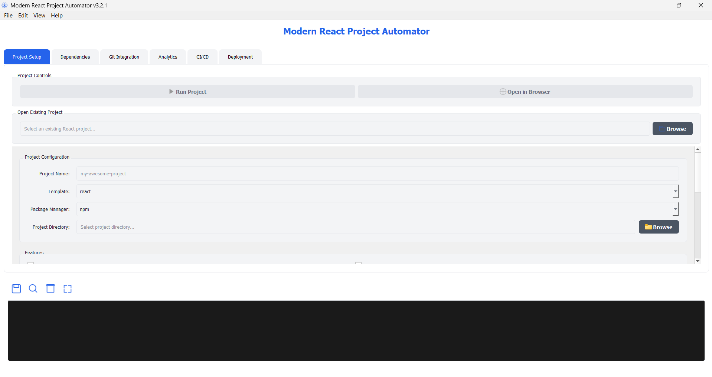
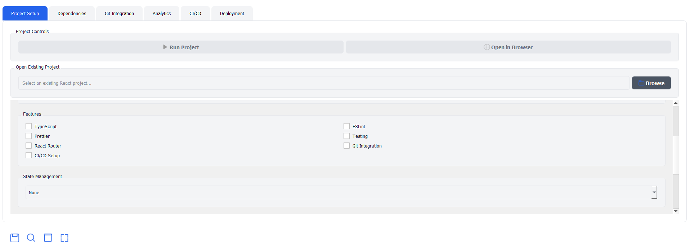
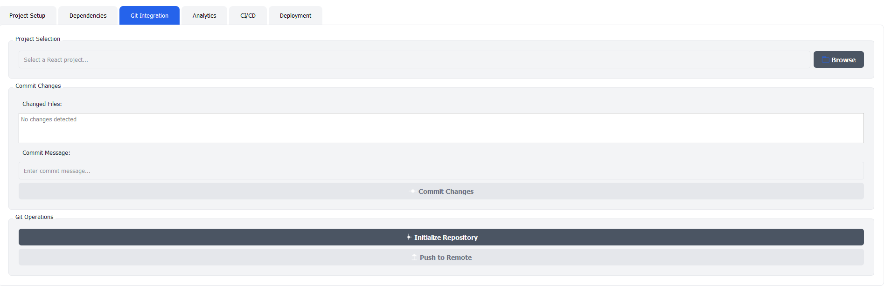
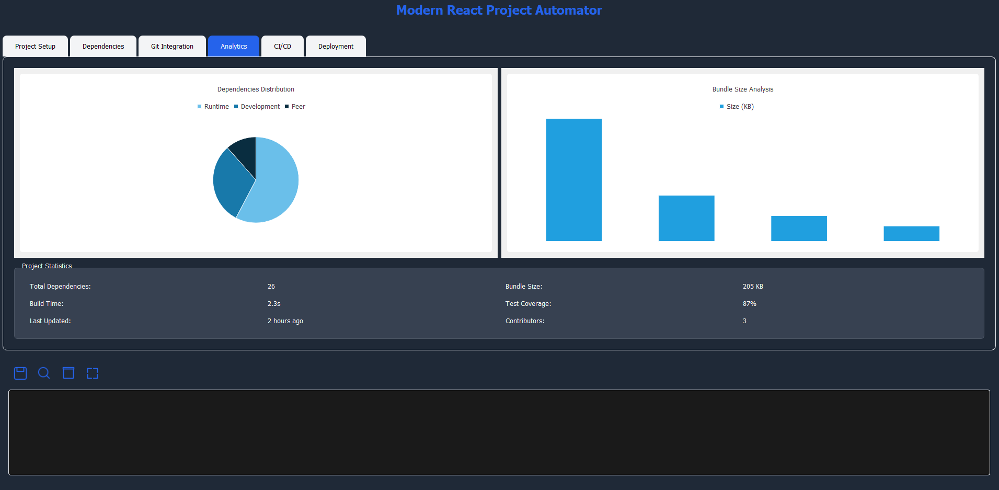
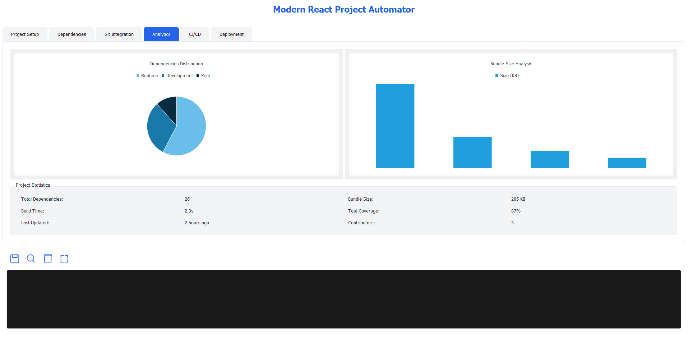

# React Project Automator 🚀


A modern desktop application for automating React project creation with an intuitive UI, Git integration, and developer-friendly features. Streamline your React project bootstrapping process! ✨

<div align="center">
  
</div>

## ✨ Features

- 🎯 **Modern UI** - Clean and intuitive interface for project configuration
- 🔄 **Live Terminal** - Real-time output for better development experience
- 🌗 **Dark/Light Theme** - Support for different working environments
- 🔧 **Project Templates** - Various starter templates for React projects
- 📦 **Dependency Management** - Easy package installation and management
- 🔄 **Git Integration** - Built-in Git workflow support
- 🚀 **Quick Deploy** - Streamlined deployment options
- 💻 **Cross-Platform** - Works on Windows, macOS, and Linux

## 🛠️ Installation

1. Clone the repository:
```bash
git clone https://github.com/yourusername/react-project-automator.git
```

2. Install dependencies:
```bash
pip install -r requirements.txt
```

3. Run the application:
```bash
python reactautomationtoolv3.pyw
```

## 📋 Prerequisites

- Python 3.8 or higher
- Node.js and npm
- Git
- PyQt5
- Qt Designer (optional, for UI development)

## 🚀 Quick Start

1. Launch the application
2. Enter your project details
3. Select desired features
4. Choose project directory
5. Click "Create Project"

## 🎨 User Interface

<div align="center">
  
  
</div>

## 🔧 Configuration Options

- **Project Settings**
  - Project name and location
  - Template selection
  - Package manager choice

- **Features**
  - TypeScript support
  - ESLint configuration
  - Prettier setup
  - Testing framework
  - Router integration
  - State management

- **Styling Solutions**
  - Tailwind CSS
  - Styled Components
  - CSS Modules
  - Custom configuration

## 🔄 Git Integration

- Repository initialization
- Commit management
- Remote repository setup
- Branch management
- Status monitoring

## 🚀 Deployment Options

- Vercel
- Netlify
- GitHub Pages
- Custom deployment

## 📝 Documentation

For detailed documentation, please visit our [Wiki](https://github.com/yourusername/react-project-automator/wiki).

## 🤝 Contributing

Contributions are welcome! Please read our [Contributing Guide](CONTRIBUTING.md) for details on our code of conduct and the process for submitting pull requests.

1. Fork the repository
2. Create your feature branch (`git checkout -b feature/AmazingFeature`)
3. Commit your changes (`git commit -m 'Add some AmazingFeature'`)
4. Push to the branch (`git push origin feature/AmazingFeature`)
5. Open a Pull Request

## 📜 License

This project is licensed under the MIT License - see the [LICENSE](LICENSE) file for details.

## 🙏 Acknowledgments

- [PyQt5](https://www.riverbankcomputing.com/software/pyqt/)
- [Node.js](https://nodejs.org/)
- [Create React App](https://create-react-app.dev/)
- [Git](https://git-scm.com/)

## 📞 Support

- Create an [Issue](https://github.com/melihcanndemir/React-Project-Automator/issues)
- Email: melihcandemir@protonmail.com

## 🌟 Show your support

Give a ⭐️ if this project helped you!

## 📸 Screenshots

<div align="center">
  
  
</div>

## 🗺️ Roadmap

- [ ] Component library integration
- [ ] Docker support
- [ ] CI/CD templates
- [ ] Project analytics
- [ ] Team collaboration features

## 📊 Stats


---

<div align="center">
  Made with ❤️ by Melih Can
</div>
